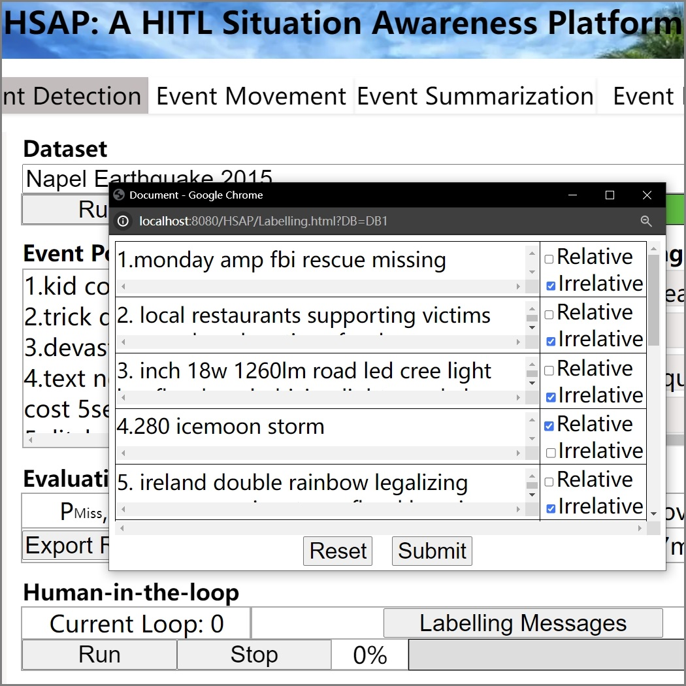

# HSAP: A Human-in-the-loop Social Media-based Situation Awareness Platform
  
  This platform provides users, security officers, and developers with a quick overview of social events.

## Features

  - Event Detection: detecting relative posts about the social event.
  - Event Movement: showing the event moving over different locations.
  - Event Summary: finding the most representative social event messages/words.
  - Event Evolution: temporal event evolving over event summarization.

## Usage

  Visit website: http://121.45.242.221:8080/HSAP/maininterface.html
  %%If you are unable to access the link, please contact me via email at ck131102@hotmail.com.

## User Interface
  
  - **Homepage** The homepage interface provides a brief introduction of HSAP, including the function of each component in HSAP. The content on this page is customized for the heading, logo, and welcome.
  - **Event Detection Interface** This interface supports the functionality of HSAP to detect the crisis events. Given a selected disaster, the interface displays the event detection results obtained by ConTF/IDF with contexts. When the current user interacts with the detected results by manually labelling a number of identified posts, the HITL filter is invoked to refine the event detection results and return the updated results to interface. For each detection process, the accuracy is automatically shown on the interface.
  - **Event summarization Interface** This interface displays the most representative and concise social event messages/words for an event selected on event detection interface. Meanwhile, it shows the ground truth summarization results for the comparison.
  - **Event Movement Interface** This interface shares the same input with event detection interface on what event to be analyzed, and dynamically visualizes the event moving trend over different locations on the world map.
  - **Event Evolution Interface** This interface visualizes the temporal evolving summaries for a selected event. We display this evolvement using two graphs. One shows the topic change over time, while the other shows the summary representative distributions.

## Running Examples

  A. Homepage  
      
  B. Event Detection Results  
      
  C. User Feedback Labelling  
      
  D. HITL Event Filtering Results  
      
  E. Event summarization Results  
      
  F. Event Movement Over Space  
      
  G. Event Evolution Over Time  
      

## License

HSAP is released under the MIT License.

## Acknowledgments

This work was supported by ARC Discovery Project DP200101175. 
